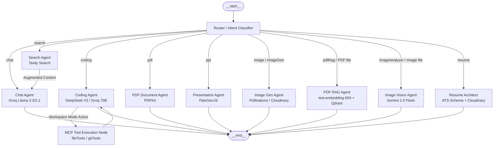
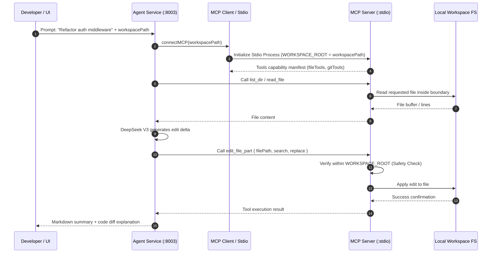
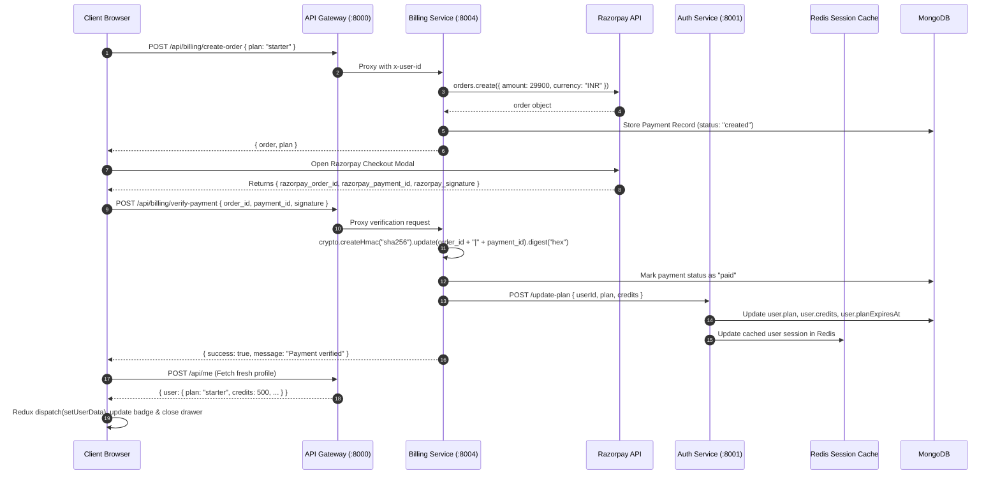

# Alpha AI — System Design & Architecture Specification

This document details the architectural blueprint, data flows, LangGraph execution graph, dynamic model tiering, Model Context Protocol (MCP) local workspace integration, responsive UI navigation matrix, session security, and microservices topology for the Alpha AI platform.

---

## 1. High-Level Component Topology

```mermaid
flowchart TB
    subgraph Client["Client Tier (Web & Desktop)"]
        UI[Workspace Web SPA - React 19]
        Desktop[Desktop Companion - Electron]
        Monaco[Monaco Editor & Sandboxed Preview]
        ReduxStore[Redux Toolkit Store]
    end

    subgraph GatewayTier["API Gateway (Express :8000)"]
        GW[Gateway Reverse Proxy]
        AuthMW[Session Middleware]
        UserCtrl[Current User Controller]
    end

    subgraph AuthTier["Auth Service (:8001)"]
        AuthApp[Auth API]
        FBAdmin[Firebase Admin SDK]
        UserDB[(MongoDB: users)]
    end

    subgraph ChatTier["Chat Service (:8002)"]
        ChatApp[Chat API]
        ConvDB[(MongoDB: conversations)]
        MsgDB[(MongoDB: messages)]
    end

    subgraph AgentTier["Agent Service (:8003)"]
        AgentApp[Agent Controller]
        GraphEngine[LangGraph Multi-Agent Engine]
        ShortMem[(Redis: 24h Conversation Memory)]
        MCPClient[MCP Client Transport]
    end

    subgraph MCPServerTier["MCP Local Workspace Engine"]
        MCPServer[MCP Server (Stdio)]
        FileTools[File & Dir Tools]
        GitTools[Git Management Tools]
        TermTools[Terminal Execution Tools]
    end

    subgraph BillingTier["Billing Service (:8004)"]
        BillingApp[Billing Controller]
        PayDB[(MongoDB: payments)]
        RazorpayEngine[Razorpay Payment Gateway]
    end

    subgraph AIProviders["External AI & Storage Infrastructure"]
        GroqLLM[Groq: Llama 3.3 70B & 3.1 8B]
        GeminiLLM[Google: Gemini 2.0 Flash & Text-Embedding-004]
        DeepSeekLLM[OpenRouter: DeepSeek V3 / R1]
        TavilyAPI[Tavily Search Engine]
        QdrantDB[Qdrant Cloud Vector Store]
        CloudinaryCDN[Cloudinary Media CDN]
    end

    UI -->|HTTP / WithCredentials| GW
    Desktop -->|Local Proxy / IPC| GW
    Desktop -.->|Open Folder / VS Code Bridge| MCPServer

    GW --> AuthMW
    AuthMW -->|Session Lookup| ShortMem
    GW -->|/api/auth| AuthApp
    GW -->|/api/me| UserCtrl
    GW -->|Protected /api/chat + x-user-id + x-user-plan| ChatApp
    GW -->|Protected /api/agent + x-user-id + x-user-plan| AgentApp
    GW -->|Protected /api/billing + x-user-id + x-user-plan| BillingApp

    AuthApp --> FBAdmin
    AuthApp --> UserDB
    AuthApp --> ShortMem

    ChatApp --> ConvDB
    ChatApp --> MsgDB

    AgentApp --> GraphEngine
    AgentApp --> MCPClient
    MCPClient <-->|Stdio Stream Protocol| MCPServer
    MCPServer --> FileTools
    MCPServer --> GitTools
    MCPServer --> TermTools

    GraphEngine --> GroqLLM
    GraphEngine --> GeminiLLM
    GraphEngine --> DeepSeekLLM
    GraphEngine --> TavilyAPI
    GraphEngine --> QdrantDB
    GraphEngine --> CloudinaryCDN

    BillingApp --> RazorpayEngine
    BillingApp --> PayDB
    BillingApp -->|Sync Plan & Credits| AuthApp
```

---

## 2. Multi-Agent Graph Architecture (LangGraph)

The Agent microservice orchestrates autonomous specialist agents inside a compiled `StateGraph` with support for both cloud artifact generation and local workspace manipulation:



---

## 3. Dynamic Model Tiering & Margin Architecture

| User Tier | Routing & Chat | Coding Engine | Vision & RAG | Document & Resumes | Marginal Unit Profit |
| :--- | :--- | :--- | :--- | :--- | :--- |
| **Free Tier** | Groq `llama-3.1-8b-instant` | Groq `llama-3.3-70b-versatile` | Gemini 2.0 Flash | Groq 8B / 70B | High Speed / Zero Cost |
| **Starter (₹299)** | Groq `llama-3.3-70b-versatile` | OpenRouter DeepSeek V3 | Gemini 2.0 Flash | Groq 70B + Cloudinary | **93%+ (₹280+ Net Profit)** |
| **Pro (₹499)** | Groq `llama-3.3-70b-versatile` | OpenRouter DeepSeek V3/R1 | Gemini 2.0 Flash | Gemini 2.0 Flash / Groq 70B | **90%+ (₹450+ Net Profit)** |

---

## 4. Responsive UI & Sidebar Navigation Architecture

The workspace layout is engineered with strict viewport boundaries (`lg: 1024px`) to avoid visual collisions and provide an ergonomic user experience across screen form-factors:

### 4.1 Responsive State & Component Visibility Matrix

| Screen Size | Breakpoint | Sidebar Mode | Active Controls | Suppressed Controls | Purpose & UX Behavior |
| :--- | :--- | :--- | :--- | :--- | :--- |
| **Small Devices** (Mobile & Tablets) | `< 1024px` | Off-canvas Drawer (`fixed inset-y-0`) | **`LuX`** (`!flex lg:!hidden`) | **`LuPanelLeft`** (`!hidden lg:!flex`) | User opens drawer via top-left hamburger menu. Header displays only `LuX` to dismiss drawer. Desktop collapse button is strictly suppressed to avoid duplicate buttons. |
| **Large Devices** (Laptops & Desktops) | `≥ 1024px` | Persistent / Collapsible (`w-90` or `w-[56px]`) | **`LuPanelLeft`** (expanded) / **`LuPanelRight`** (collapsed) | **`LuX`** (`lg:!hidden`) | Sidebar is an integral column of the layout. `LuX` is strictly suppressed. Clicking `LuPanelLeft` collapses sidebar into a 56px mini-dock, restored via `LuPanelRight`. |

### 4.2 Sidebar State Flow

```mermaid
stateDiagram-v2
    [*] --> DesktopExpanded: Screen >= 1024px
    [*] --> MobileClosed: Screen < 1024px

    state "Desktop (lg+)" as DesktopGroup {
        DesktopExpanded --> DesktopCollapsed: Click LuPanelLeft (!hidden lg:!flex)
        DesktopCollapsed --> DesktopExpanded: Click LuPanelRight
        note right of DesktopExpanded: LuX is strictly hidden (lg:!hidden)
    }

    state "Mobile / Small (< lg)" as MobileGroup {
        MobileClosed --> MobileOpen: Tap Hamburger Menu (LuMenu)
        MobileOpen --> MobileClosed: Tap LuX (!flex lg:!hidden) or Backdrop
        note right of MobileOpen: LuPanelLeft is strictly hidden (!hidden)
    }
```

---

## 5. Model Context Protocol (MCP) & Local Workspace Flow

When running with an active local workspace (via Desktop Companion or local path config), the Coding Agent communicates with the MCP server to inspect and modify files safely:



---

## 6. End-to-End Billing & Real-Time Sync Flow



---

## 7. Security & Isolation Matrix

1. **Authentication & Identity**:
   - HTTP-only session cookies with strict TTL (7 days) and sanitized session UUIDs stored in Redis.
   - Gateway verifies sessions against Redis and dynamically injects `x-user-id` and `x-user-plan` to protected downstream microservices.
2. **Local Workspace Safety (MCP Guardrails)**:
   - MCP server strictly confines all filesystem mutations within `WORKSPACE_ROOT`.
   - Workspace root deletion is explicitly denied by `delete_file_or_dir`.
   - Path traversals (e.g. `../../etc/passwd`) are blocked with canonical resolution checks.
3. **Responsive UI Collision Prevention**:
   - Navigation action controls use prioritized utility overrides (`!hidden lg:!flex` vs `!flex lg:!hidden`) to eliminate UI flicker and guarantee single-action visibility across breakpoints.
4. **Payment Integrity**:
   - Razorpay HMAC verification is calculated server-side. No client-supplied credit or plan values are ever trusted.
5. **Execution Sandboxing**:
   - Web code artifacts generated by the coding agent run strictly in a sandboxed iframe (`sandbox="allow-scripts"`).
6. **Rate Limiting & Abuse Prevention**:
   - Redis-backed rate limiting per user per agent with exponential TTL backoff.
