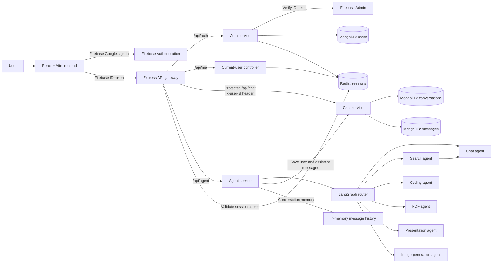
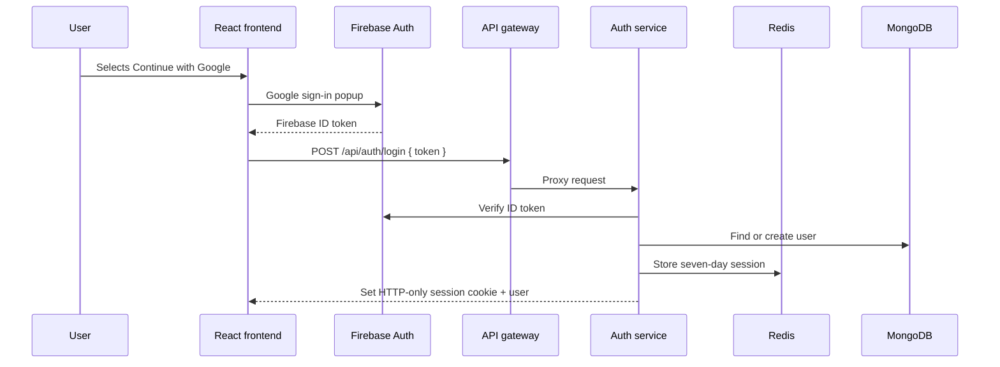
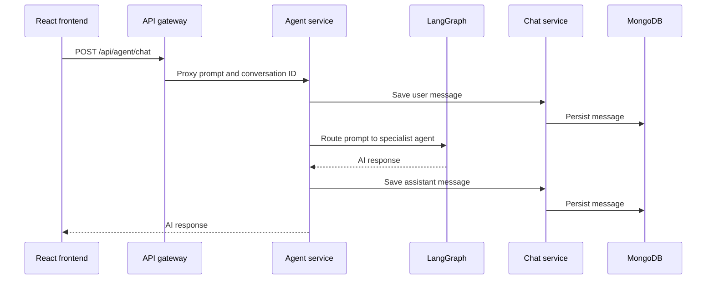

# Alpha AI system design

## Component diagram

## Authentication flow

## Prompt and persistence flow

## Service responsibilities

| Component | Responsibility |
| --- | --- |
| Frontend | Sign-in UI, chat workspace, Redux client state, API calls |
| Gateway | CORS, cookie parsing, session validation, routing/proxying, trusted user-ID propagation to chat |
| Auth service | Firebase Admin verification, user provisioning, Redis session lifecycle |
| Chat service | Conversation and message persistence in MongoDB |
| Agent service | Prompt routing, specialist-agent execution, short-term conversation memory, message saving |
| Redis | Session store with seven-day expiry |
| MongoDB | User, conversation, and message records |
