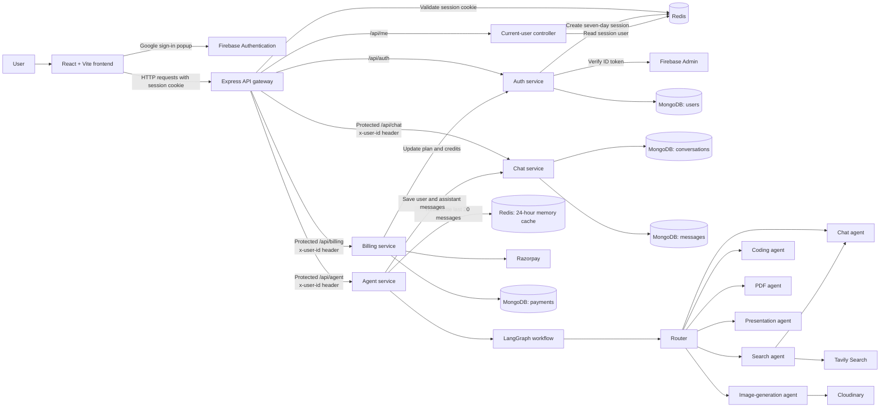
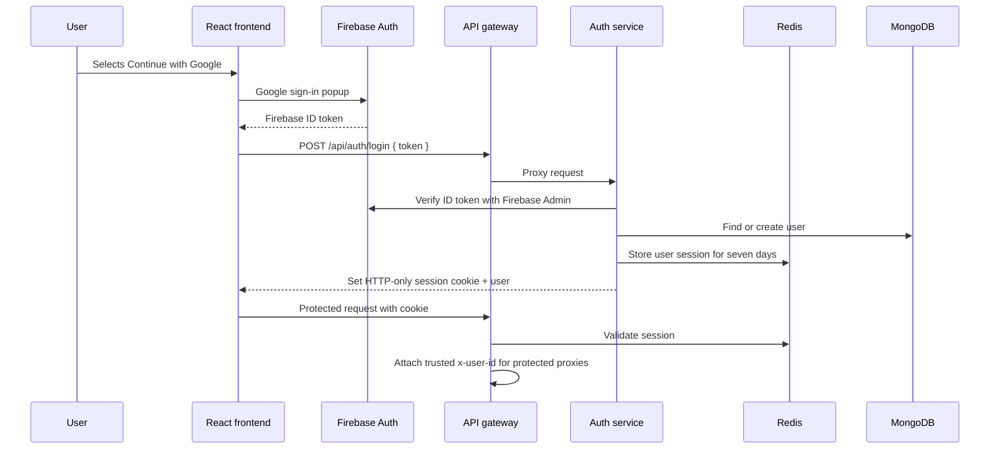
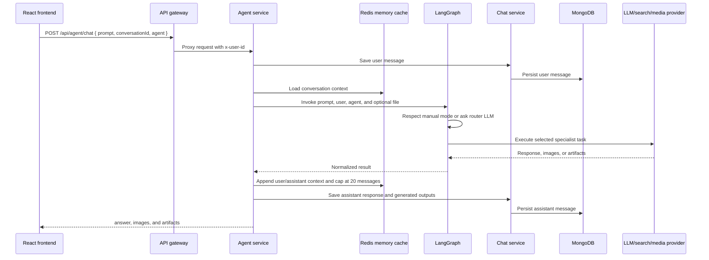
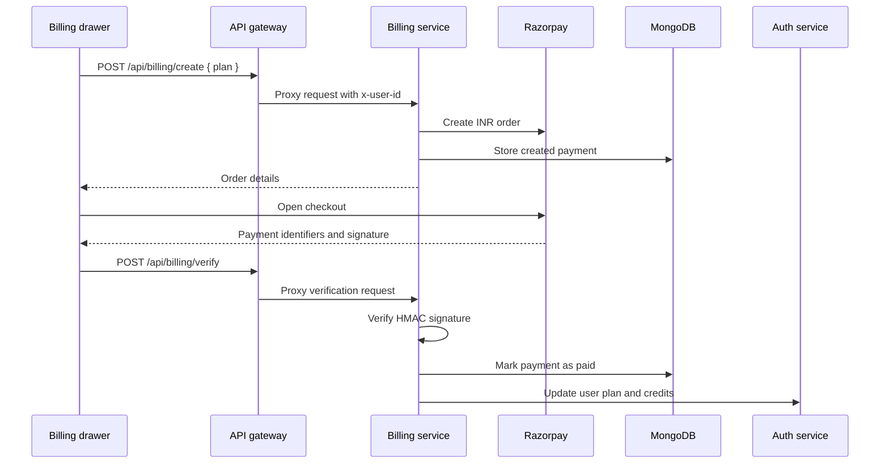

# Alpha AI system design

This document describes the implemented request path between the React workspace, the API gateway, backend services, external providers, and persistence layers.

## Component diagram

## Frontend composition

The frontend is a single React page assembled by `Home`:

| Area | Implementation responsibility |
| --- | --- |
| `Home` | Restores `/api/me`, shows the loading skeleton, and gates the workspace behind Google sign-in |
| `SideBar` | Loads conversations, creates a new-chat state, selects conversations, toggles collapse, opens billing, and logs out |
| `ChatArea` | Loads messages for the selected conversation and combines navigation, message list, and composer |
| `ChatInput` | Chooses `auto`, `chat`, `coding`, `pdf`, `ppt`, `image`, or `search`; creates a conversation on first send; submits prompts |
| `MessageBubble` | Renders Markdown/GFM, code blocks, images, lightbox viewing, external links, and artifact downloads |
| `Artifact` | Shows generated files in Monaco and previews `index.html` with related CSS and JavaScript in a sandboxed iframe |
| `BillingDrawer` | Displays plan/credit state and starts Razorpay upgrades |
| Redux store | Holds user, conversation, message, and artifact state |

The browser uses Axios with `withCredentials: true`, so the server-managed `session` cookie is sent to the gateway. The artifact panel is rendered only at the extra-large responsive breakpoint; message-level downloads remain available independently.

## Authentication and session flow

Unauthenticated protected requests receive `401`. The gateway also clears an expired session cookie. CORS is restricted to the configured frontend origin and credentials are enabled for cookie transport.

## Prompt, routing, and persistence flow

`auto` uses the router's classification rules. A manually selected mode bypasses classification. Search flows pass through the search agent and then the chat agent for response composition. Other specialist nodes return directly to the workflow end.

## Billing flow

The frontend currently exposes Starter and Pro plans. Payment verification and credit updates must remain server-side responsibilities.

## Service responsibilities

| Component | Responsibility |
| --- | --- |
| Frontend | Authentication UI, responsive chat workspace, Redux state, API calls, Markdown and artifact presentation |
| Gateway | CORS, JSON/cookie middleware, Redis session validation, route proxying, and trusted user-ID propagation |
| Auth service | Firebase Admin verification, user provisioning, session lifecycle, and plan/credit updates |
| Chat service | Conversation and message persistence in MongoDB |
| Billing service | Razorpay order creation, payment signature verification, payment records, and plan upgrades |
| Agent service | Request validation, LangGraph execution, specialist coordination, response normalization, and message persistence orchestration |
| Router | Manual agent selection or LLM-based classification into one specialist |
| Redis | Seven-day sessions and 24-hour, capped short-term conversation memory |
| MongoDB | User, conversation, message, and payment records |
| Firebase | Google identity and ID-token issuance |
| External providers | LLM inference, Tavily web search, Cloudinary media storage, and Razorpay payments |

## Important implementation notes

- The agent controller can accept a multipart file, but the current composer only exposes visual attachment controls; upload behavior is not wired into the UI yet.
- The artifact preview uses `sandbox="allow-scripts"` and should continue to treat generated HTML as untrusted content.
- Billing routes are intended to expose `/create` and `/verify` through the gateway. The billing route file currently registers both controller handlers under `/create`, so verification routing should be corrected before enabling production payments.
- Conversation ownership and downstream authorization should be enforced consistently in the chat service before production deployment.
