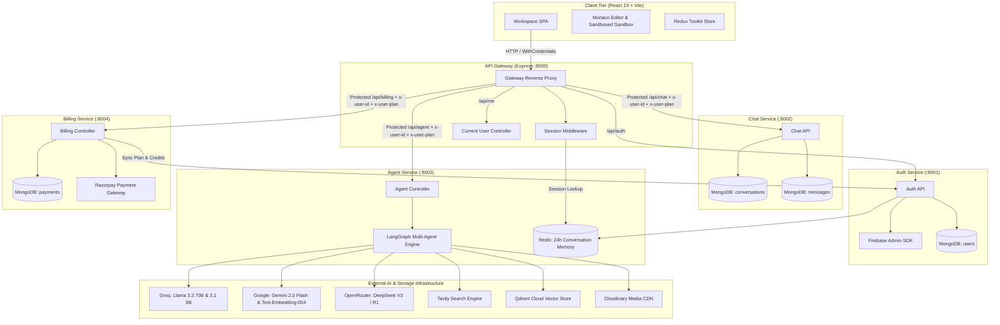
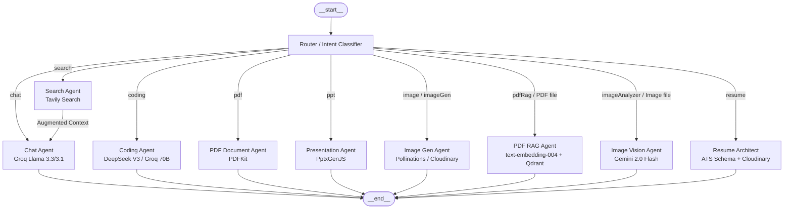
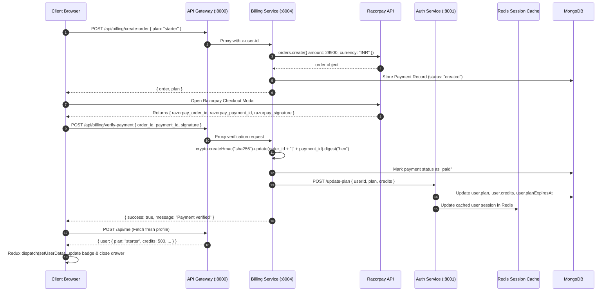

# Alpha AI — System Design & Architecture Specification

This document details the architectural blueprint, data flows, LangGraph execution graph, dynamic model tiering, session security, and microservices topology for the Alpha AI platform.

---

## 1. High-Level Component Topology

---

## 2. Multi-Agent Graph Architecture (LangGraph)

The Agent microservice orchestrates autonomous specialist agents inside a compiled `StateGraph`:

---

## 3. Dynamic Model Tiering & Margin Architecture

| User Tier | Routing & Chat | Coding Engine | Vision & RAG | Document & Resumes | Marginal Unit Profit |
| :--- | :--- | :--- | :--- | :--- | :--- |
| **Free Tier** | Groq `llama-3.1-8b-instant` | Groq `llama-3.3-70b-versatile` | Gemini 2.0 Flash | Groq 8B / 70B | High Speed / Zero Cost |
| **Starter (₹299)** | Groq `llama-3.3-70b-versatile` | OpenRouter DeepSeek V3 | Gemini 2.0 Flash | Groq 70B + Cloudinary | **93%+ (₹280+ Net Profit)** |
| **Pro (₹499)** | Groq `llama-3.3-70b-versatile` | OpenRouter DeepSeek V3/R1 | Gemini 2.0 Flash | Gemini 2.0 Flash / Groq 70B | **90%+ (₹450+ Net Profit)** |

---

## 4. End-to-End Billing & Real-Time Sync Flow

---

## 5. Security & Isolation Matrix

1. **Authentication & Identity**:
   - HTTP-only session cookie set with strict expiry (7 days) and sanitized session UUID keys.
   - Gateway verifies sessions against Redis and dynamically injects `x-user-id` and `x-user-plan` to protected downstream services.
2. **Payment Integrity**:
   - Razorpay HMAC verification is calculated server-side. No client-supplied credit or plan values are ever trusted.
3. **Execution Sandboxing**:
   - Code artifacts generated by the coding agent run strictly in a sandboxed iframe (`sandbox="allow-scripts"`).
4. **Rate Limiting & Abuse Prevention**:
   - Redis-backed rate limiting per user per agent with exponential TTL backoff.
