# Alpha AI — System Design & Architecture Specification

This document details the architectural blueprint, data flows, LangGraph execution graph, dynamic model tiering, Model Context Protocol (MCP) local workspace integration, responsive UI navigation matrix, session security, and microservices topology for the Alpha AI platform.

---

## 1. High-Level Component Topology

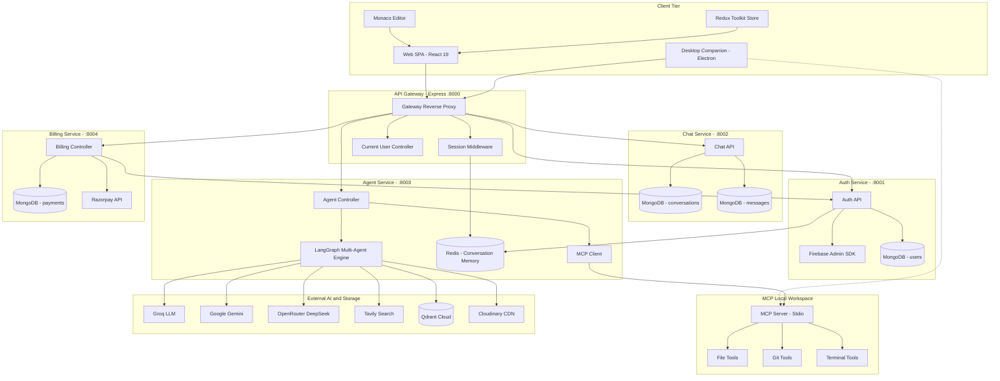
```mermaid
flowchart TB

    subgraph CLIENT["Client Tier"]
        UI["Web SPA - React 19"]
        DESKTOP["Desktop Companion - Electron"]
        MONACO["Monaco Editor"]
        REDUX["Redux Toolkit Store"]
    end

    subgraph GATEWAY["API Gateway - Express :8000"]
        GW["Gateway Reverse Proxy"]
        AUTHMW["Session Middleware"]
        USERCTRL["Current User Controller"]
    end

    subgraph AUTH["Auth Service - :8001"]
        AUTHAPP["Auth API"]
        FB["Firebase Admin SDK"]
        USERDB[("MongoDB - users")]
    end

    subgraph CHAT["Chat Service - :8002"]
        CHATAPP["Chat API"]
        CONVDB[("MongoDB - conversations")]
        MSGDB[("MongoDB - messages")]
    end

    subgraph AGENT["Agent Service - :8003"]
        AGENTAPP["Agent Controller"]
        GRAPH["LangGraph Multi-Agent Engine"]
        REDIS[("Redis - Conversation Memory")]
        MCPCLIENT["MCP Client"]
    end

    subgraph MCP["MCP Local Workspace"]
        MCPSERVER["MCP Server - Stdio"]
        FILETOOLS["File Tools"]
        GITTOOLS["Git Tools"]
        TERMTOOLS["Terminal Tools"]
    end

    subgraph BILLING["Billing Service - :8004"]
        BILLINGAPP["Billing Controller"]
        PAYDB[("MongoDB - payments")]
        RAZORPAY["Razorpay API"]
    end

    subgraph AI["External AI and Storage"]
        GROQ["Groq LLM"]
        GEMINI["Google Gemini"]
        DEEPSEEK["OpenRouter DeepSeek"]
        TAVILY["Tavily Search"]
        QDRANT[("Qdrant Cloud")]
        CLOUDINARY["Cloudinary CDN"]
    end

    UI --> GW
    DESKTOP --> GW
    DESKTOP -.-> MCPSERVER
    MONACO --> UI
    REDUX --> UI

    GW --> AUTHMW
    AUTHMW --> REDIS

    GW --> AUTHAPP
    GW --> USERCTRL
    GW --> CHATAPP
    GW --> AGENTAPP
    GW --> BILLINGAPP

    AUTHAPP --> FB
    AUTHAPP --> USERDB
    AUTHAPP --> REDIS

    CHATAPP --> CONVDB
    CHATAPP --> MSGDB

    AGENTAPP --> GRAPH
    AGENTAPP --> MCPCLIENT
    MCPCLIENT --> MCPSERVER

    MCPSERVER --> FILETOOLS
    MCPSERVER --> GITTOOLS
    MCPSERVER --> TERMTOOLS

    GRAPH --> GROQ
    GRAPH --> GEMINI
    GRAPH --> DEEPSEEK
    GRAPH --> TAVILY
    GRAPH --> QDRANT
    GRAPH --> CLOUDINARY

    BILLINGAPP --> RAZORPAY
    BILLINGAPP --> PAYDB
    BILLINGAPP --> AUTHAPP
```

---

## 2. Multi-Agent Graph Architecture

The Agent Service orchestrates specialist agents through a compiled LangGraph `StateGraph`.

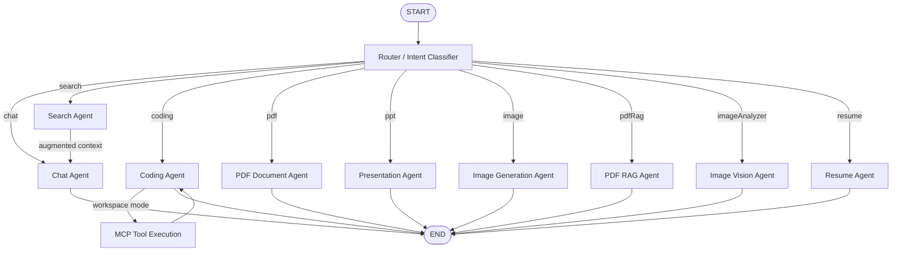
```mermaid
flowchart TD

    START(["START"])

    ROUTER["Router / Intent Classifier"]

    CHAT["Chat Agent"]
    SEARCH["Search Agent"]
    CODING["Coding Agent"]
    PDF["PDF Document Agent"]
    PPT["Presentation Agent"]
    IMAGE["Image Generation Agent"]
    PDFRAG["PDF RAG Agent"]
    VISION["Image Vision Agent"]
    RESUME["Resume Agent"]

    MCPTOOLS["MCP Tool Execution"]

    END(["END"])

    START --> ROUTER

    ROUTER -->|chat| CHAT
    ROUTER -->|search| SEARCH
    ROUTER -->|coding| CODING
    ROUTER -->|pdf| PDF
    ROUTER -->|ppt| PPT
    ROUTER -->|image| IMAGE
    ROUTER -->|pdfRag| PDFRAG
    ROUTER -->|imageAnalyzer| VISION
    ROUTER -->|resume| RESUME

    SEARCH -->|augmented context| CHAT

    CODING -->|workspace mode| MCPTOOLS
    MCPTOOLS --> CODING

    CHAT --> END
    CODING --> END
    PDF --> END
    PPT --> END
    IMAGE --> END
    PDFRAG --> END
    VISION --> END
    RESUME --> END
```

### Agent Responsibilities

| Agent         | Primary Responsibility                     | Main Technology            |
| ------------- | ------------------------------------------ | -------------------------- |
| Router Agent  | Detect user intent and select specialist   | LangGraph                  |
| Chat Agent    | General conversation and reasoning         | Groq / Gemini              |
| Search Agent  | Web search and information retrieval       | Tavily                     |
| Coding Agent  | Code generation, debugging and refactoring | DeepSeek / Groq            |
| PDF Agent     | Generate PDF documents                     | PDFKit                     |
| PPT Agent     | Generate presentations                     | PptxGenJS                  |
| Image Agent   | Generate images                            | Image generation provider  |
| PDF RAG Agent | Query uploaded PDF documents               | Gemini Embeddings + Qdrant |
| Vision Agent  | Analyze uploaded images                    | Gemini Vision              |
| Resume Agent  | Generate structured ATS-friendly resumes   | LLM + Cloudinary           |
| MCP Tool Node | Execute local workspace operations         | MCP                        |

---

## 3. Dynamic Model Tiering

| User Tier          | Routing & Chat | Coding Engine  | Vision & RAG | Documents & Resume |
| ------------------ | -------------- | -------------- | ------------ | ------------------ |
| **Free**           | Groq 8B        | Groq 70B       | Gemini Flash | Groq               |
| **Starter - ₹299** | Groq 70B       | DeepSeek       | Gemini Flash | Groq 70B           |
| **Pro - ₹499**     | Groq 70B       | DeepSeek V3/R1 | Gemini Flash | Gemini / Groq 70B  |

> Model availability, pricing, rate limits, and provider names can change. Production routing should therefore be configuration-driven rather than hard-coded into the architecture document.

### Routing Concept

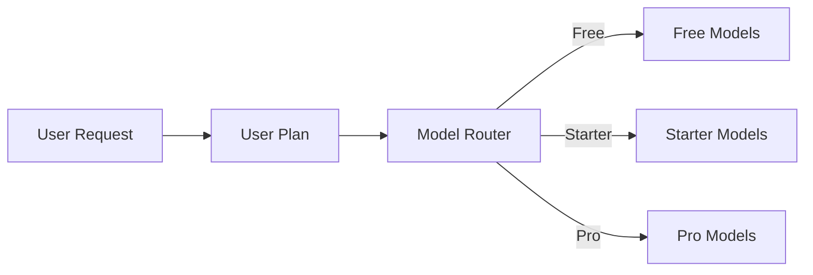
```mermaid
flowchart LR

    USER["User Request"]

    PLAN["User Plan"]

    ROUTER["Model Router"]

    FREE["Free Models"]
    STARTER["Starter Models"]
    PRO["Pro Models"]

    USER --> PLAN
    PLAN --> ROUTER

    ROUTER -->|Free| FREE
    ROUTER -->|Starter| STARTER
    ROUTER -->|Pro| PRO
```

---

## 4. Responsive UI and Sidebar Navigation

The workspace uses a `1024px` breakpoint to separate mobile and desktop navigation behavior.

### 4.1 Responsive State and Component Visibility Matrix

| Screen Size       | Breakpoint  | Sidebar Mode             | Active Controls                | Suppressed Controls | UX Behavior                                |
| ----------------- | ----------- | ------------------------ | ------------------------------ | ------------------- | ------------------------------------------ |
| **Small Devices** | `< 1024px`  | Off-canvas Drawer        | `LuX`                          | `LuPanelLeft`       | Hamburger opens drawer; `LuX` closes it    |
| **Large Devices** | `>= 1024px` | Persistent / Collapsible | `LuPanelLeft` / `LuPanelRight` | `LuX`               | Sidebar remains in layout and can collapse |

### 4.2 Sidebar State Flow

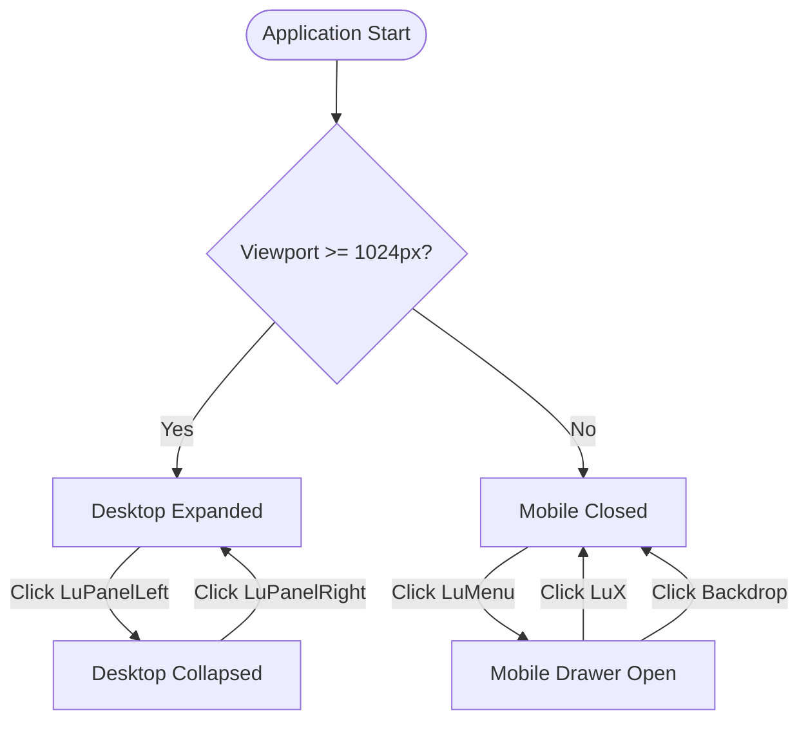
```mermaid
flowchart TD

    START(["Application Start"])

    VIEWPORT{"Viewport >= 1024px?"}

    MOBILE["Mobile Closed"]

    DESKTOP_EXPANDED["Desktop Expanded"]

    DESKTOP_COLLAPSED["Desktop Collapsed"]

    MOBILE_OPEN["Mobile Drawer Open"]

    START --> VIEWPORT

    VIEWPORT -->|Yes| DESKTOP_EXPANDED
    VIEWPORT -->|No| MOBILE

    DESKTOP_EXPANDED -->|Click LuPanelLeft| DESKTOP_COLLAPSED
    DESKTOP_COLLAPSED -->|Click LuPanelRight| DESKTOP_EXPANDED

    MOBILE -->|Click LuMenu| MOBILE_OPEN
    MOBILE_OPEN -->|Click LuX| MOBILE
    MOBILE_OPEN -->|Click Backdrop| MOBILE
```

### Desktop State

```text
Expanded
    |
    | Click LuPanelLeft
    v
Collapsed
    |
    | Click LuPanelRight
    v
Expanded
```

### Mobile State

```text
Closed
   |
   | Click LuMenu
   v
Open
   |
   +---- Click LuX ------> Closed
   |
   +---- Click Backdrop -> Closed
```

---

## 5. Model Context Protocol (MCP) and Local Workspace

The Coding Agent can communicate with an MCP Server to inspect and modify files inside a controlled local workspace.

### MCP Architecture

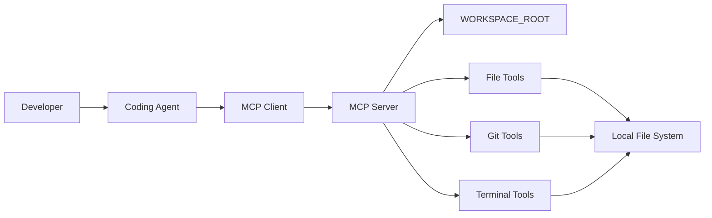
```mermaid
flowchart LR

    USER["Developer"]

    AGENT["Coding Agent"]

    MCPCLIENT["MCP Client"]

    SERVER["MCP Server"]

    ROOT["WORKSPACE_ROOT"]

    FILES["File Tools"]

    GIT["Git Tools"]

    TERMINAL["Terminal Tools"]

    FS["Local File System"]

    USER --> AGENT

    AGENT --> MCPCLIENT

    MCPCLIENT --> SERVER

    SERVER --> ROOT

    SERVER --> FILES
    SERVER --> GIT
    SERVER --> TERMINAL

    FILES --> FS
    GIT --> FS
    TERMINAL --> FS
```

### MCP Local Workspace Sequence

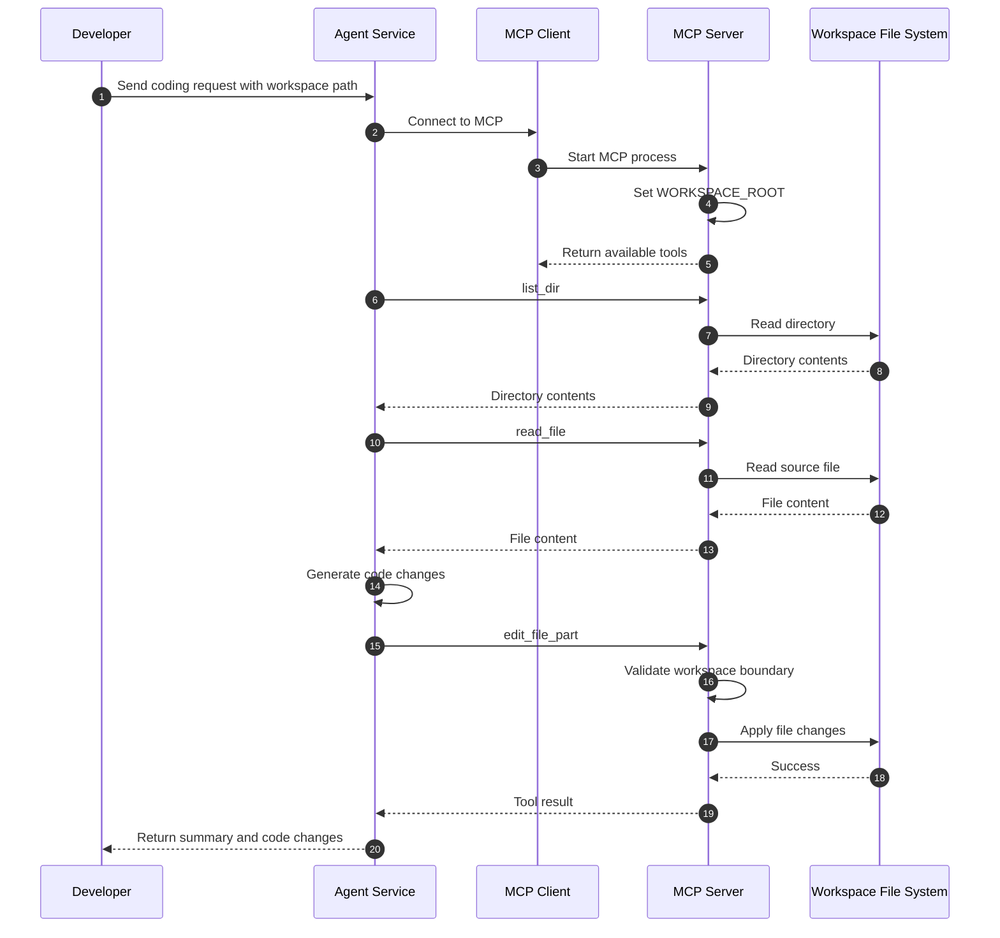
```mermaid
sequenceDiagram

    autonumber

    participant User as Developer
    participant Agent as Agent Service
    participant MCPClient as MCP Client
    participant Server as MCP Server
    participant FS as Workspace File System

    User->>Agent: Send coding request with workspace path

    Agent->>MCPClient: Connect to MCP

    MCPClient->>Server: Start MCP process

    Server->>Server: Set WORKSPACE_ROOT

    Server-->>MCPClient: Return available tools

    Agent->>Server: list_dir

    Server->>FS: Read directory

    FS-->>Server: Directory contents

    Server-->>Agent: Directory contents

    Agent->>Server: read_file

    Server->>FS: Read source file

    FS-->>Server: File content

    Server-->>Agent: File content

    Agent->>Agent: Generate code changes

    Agent->>Server: edit_file_part

    Server->>Server: Validate workspace boundary

    Server->>FS: Apply file changes

    FS-->>Server: Success

    Server-->>Agent: Tool result

    Agent-->>User: Return summary and code changes
```

### MCP Safety Boundary

The MCP server should enforce the following rules:

1. Every file path is resolved against `WORKSPACE_ROOT`.
2. Paths escaping `WORKSPACE_ROOT` are rejected.
3. Workspace root deletion is denied.
4. File operations are validated before execution.
5. Terminal commands should be restricted according to the application's security model.
6. The Agent should not directly access the filesystem; filesystem operations should go through MCP tools.

---

## 6. End-to-End Billing Flow

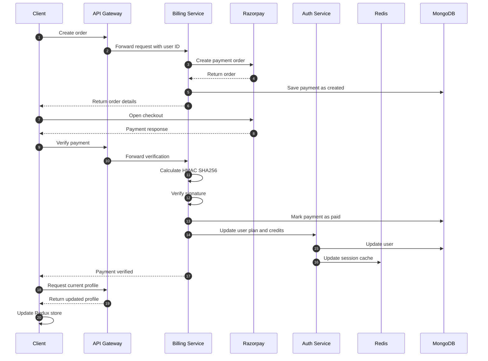
```mermaid
sequenceDiagram

    autonumber

    participant User as Client
    participant Gateway as API Gateway
    participant Billing as Billing Service
    participant Razorpay as Razorpay
    participant Auth as Auth Service
    participant Redis as Redis
    participant Mongo as MongoDB

    User->>Gateway: Create order

    Gateway->>Billing: Forward request with user ID

    Billing->>Razorpay: Create payment order

    Razorpay-->>Billing: Return order

    Billing->>Mongo: Save payment as created

    Billing-->>User: Return order details

    User->>Razorpay: Open checkout

    Razorpay-->>User: Payment response

    User->>Gateway: Verify payment

    Gateway->>Billing: Forward verification

    Billing->>Billing: Calculate HMAC SHA256

    Billing->>Billing: Verify signature

    Billing->>Mongo: Mark payment as paid

    Billing->>Auth: Update user plan and credits

    Auth->>Mongo: Update user

    Auth->>Redis: Update session cache

    Billing-->>User: Payment verified

    User->>Gateway: Request current profile

    Gateway-->>User: Return updated profile

    User->>User: Update Redux store
```

### Payment Security

The payment verification flow should follow this model:

```text
Client
   |
   | Payment Details
   v
API Gateway
   |
   v
Billing Service
   |
   | HMAC SHA256
   v
Signature Verification
   |
   +---- Invalid ----> Reject Payment
   |
   +---- Valid ------> Mark Payment Paid
                            |
                            v
                       Update User Plan
                            |
                            v
                       Update Credits
```

The server must calculate and verify the Razorpay signature. Client-provided plan, credit, or payment-status values should not be trusted.

---

## 7. Security and Isolation Matrix

### 7.1 Authentication and Identity

* HTTP-only authentication/session cookies.
* Session expiration should be enforced server-side.
* Session identifiers should be generated using cryptographically secure randomness.
* Redis can be used for session lookup and revocation.
* Gateway validates the authenticated session before forwarding protected requests.
* Gateway injects trusted identity information into downstream requests.
* Downstream services should not blindly trust client-supplied `x-user-id` or `x-user-plan` headers.

### 7.2 Local Workspace Safety

* MCP operations are restricted to `WORKSPACE_ROOT`.
* Canonical path resolution prevents path traversal.
* Workspace root deletion is denied.
* File operations are validated before execution.
* Git operations should be scoped to the selected workspace.
* Terminal execution should have additional restrictions because arbitrary command execution is high-risk.

### 7.3 Responsive UI Safety

Navigation controls use breakpoint-specific visibility rules:

```text
Mobile:
    LuMenu -> LuX

Desktop:
    LuPanelLeft -> LuPanelRight
```

Only the controls appropriate for the current viewport should be visible.

### 7.4 Payment Integrity

* Payment signatures are verified server-side.
* Razorpay secret credentials remain on the server.
* Client-side price values are not trusted.
* Client-side plan values are validated against server configuration.
* Payment status is updated only after successful verification.

### 7.5 Artifact Execution

Generated web artifacts should be rendered in a sandboxed environment.

Example:

```html
<iframe sandbox="allow-scripts"></iframe>
```

The exact sandbox permissions should be minimized according to the features required by the preview.

### 7.6 Rate Limiting

Redis-backed rate limiting can be applied per:

```text
User
  |
  +-- Chat requests
  |
  +-- Agent requests
  |
  +-- Search requests
  |
  +-- File operations
  |
  +-- Authentication attempts
```

Rate limits should be enforced at the gateway and, where necessary, again inside sensitive services.

---

## 8. Request Flow Through the Platform

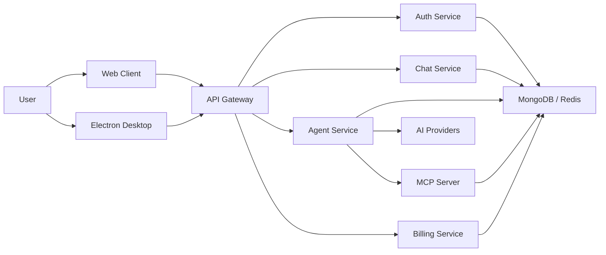
```mermaid
flowchart LR

    USER["User"]

    WEB["Web Client"]
    DESKTOP["Electron Desktop"]

    GATEWAY["API Gateway"]

    AUTH["Auth Service"]
    CHAT["Chat Service"]
    AGENT["Agent Service"]
    BILLING["Billing Service"]

    AI["AI Providers"]
    MCP["MCP Server"]
    DATABASE["MongoDB / Redis"]

    USER --> WEB
    USER --> DESKTOP

    WEB --> GATEWAY
    DESKTOP --> GATEWAY

    GATEWAY --> AUTH
    GATEWAY --> CHAT
    GATEWAY --> AGENT
    GATEWAY --> BILLING

    AUTH --> DATABASE
    CHAT --> DATABASE
    AGENT --> DATABASE
    BILLING --> DATABASE

    AGENT --> AI
    AGENT --> MCP

    MCP --> DATABASE
```

---

## 9. Service Responsibility Matrix

| Service         |    Port | Responsibility                                         | Primary Dependencies            |
| --------------- | ------: | ------------------------------------------------------ | ------------------------------- |
| API Gateway     |  `8000` | Routing, authentication middleware, request forwarding | Redis                           |
| Auth Service    |  `8001` | Authentication, users, sessions, plans                 | MongoDB, Firebase, Redis        |
| Chat Service    |  `8002` | Conversations and messages                             | MongoDB                         |
| Agent Service   |  `8003` | LangGraph agents and AI orchestration                  | Redis, AI providers, MCP        |
| Billing Service |  `8004` | Orders, payments and verification                      | MongoDB, Razorpay               |
| MCP Server      | `stdio` | Local workspace operations                             | Local filesystem, Git, terminal |

---

## 10. Data Ownership

A clear ownership model prevents services from directly modifying another service's data.

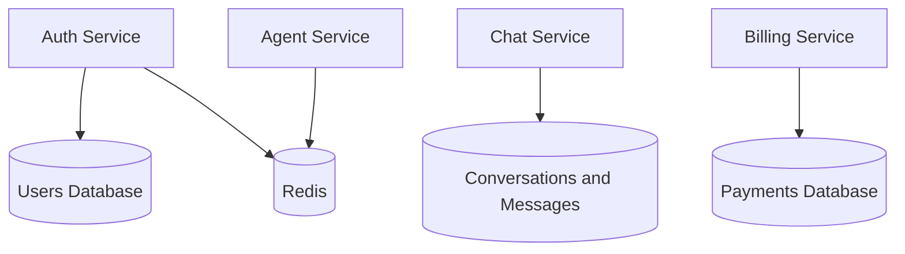
```mermaid
flowchart TD

    AUTH["Auth Service"]

    USERDB[("Users Database")]

    CHAT["Chat Service"]

    CHATDB[("Conversations and Messages")]

    BILLING["Billing Service"]

    PAYMENTDB[("Payments Database")]

    AGENT["Agent Service"]

    REDIS[("Redis")]

    AUTH --> USERDB

    CHAT --> CHATDB

    BILLING --> PAYMENTDB

    AUTH --> REDIS
    AGENT --> REDIS
```

### Ownership Rules

```text
Auth Service
    -> Owns users, plans and account state

Chat Service
    -> Owns conversations and messages

Billing Service
    -> Owns payment records

Agent Service
    -> Owns agent execution state

MCP Server
    -> Owns no application database
    -> Operates on the local workspace
```

---

## 11. Complete Request Lifecycle

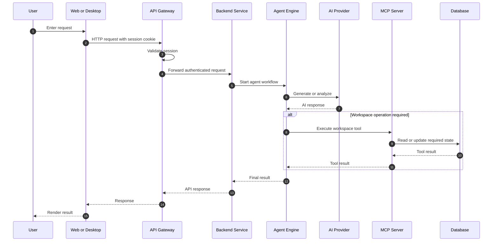
```mermaid
sequenceDiagram

    autonumber

    participant User as User
    participant Client as Web or Desktop
    participant Gateway as API Gateway
    participant Service as Backend Service
    participant Agent as Agent Engine
    participant Provider as AI Provider
    participant MCP as MCP Server
    participant DB as Database

    User->>Client: Enter request

    Client->>Gateway: HTTP request with session cookie

    Gateway->>Gateway: Validate session

    Gateway->>Service: Forward authenticated request

    Service->>Agent: Start agent workflow

    Agent->>Provider: Generate or analyze

    Provider-->>Agent: AI response

    alt Workspace operation required
        Agent->>MCP: Execute workspace tool
        MCP->>DB: Read or update required state
        DB-->>MCP: Tool result
        MCP-->>Agent: Tool result
    end

    Agent-->>Service: Final result

    Service-->>Gateway: API response

    Gateway-->>Client: Response

    Client-->>User: Render result
```

---

## 12. Architecture Summary

```text
                         ALPHA AI
                            |
              +-------------+-------------+
              |                           |
         Client Tier                 API Gateway
              |                           |
       +------+-------+          +--------+--------+
       |              |          |        |        |
      Web          Electron     Auth     Chat     Billing
       |              |          |        |        |
       +------+-------+          +--------+--------+
              |                           |
              |                       Agent Service
              |                           |
              |                  +--------+---------+
              |                  |        |         |
              |              LangGraph   Redis     MCP
              |                  |
              |          +-------+-------+
              |          |       |       |
              |        Groq   Gemini  DeepSeek
              |          |
              |       Tavily
              |          |
              |       Qdrant
              |
          MongoDB / Redis
```

---

## 13. Technology Stack

### Frontend

* React 19
* Redux Toolkit
* Tailwind CSS
* Framer Motion
* Monaco Editor

### Desktop

* Electron
* IPC
* Local MCP integration

### Backend

* Node.js
* Express.js
* TypeScript / JavaScript
* REST APIs
* Microservices architecture

### AI

* LangGraph
* LangChain
* Groq
* Google Gemini
* OpenRouter / DeepSeek
* Tavily

### Data

* MongoDB
* Redis
* Qdrant

### Workspace

* Model Context Protocol
* Local filesystem tools
* Git tools
* Terminal tools

### Payments

* Razorpay
* HMAC SHA256 verification

### Storage

* Cloudinary

---

## 14. Architectural Principles

Alpha AI follows these core principles:

1. **Service Ownership**
   Each microservice owns its domain data and business logic.

2. **Gateway-Centric Access**
   Client requests enter through the API Gateway.

3. **Authenticated Service Communication**
   Protected downstream requests receive trusted user identity from the gateway.

4. **Agent Orchestration**
   LangGraph coordinates specialized AI capabilities.

5. **Tool-Based Workspace Access**
   Local workspace operations are performed through MCP instead of direct filesystem access from the LLM.

6. **Workspace Isolation**
   MCP filesystem operations remain inside the configured workspace boundary.

7. **Server-Side Payment Verification**
   Payment signatures and plan changes are verified server-side.

8. **Model Routing**
   AI providers are selected according to task, user plan, cost, latency, and availability.

9. **Responsive UI**
   Mobile and desktop navigation use different interaction models.

10. **Security by Boundary**
    Authentication, gateway, service, MCP, database, and execution boundaries should be enforced independently.

---

## 15. Future Scalability

The architecture can later evolve toward:

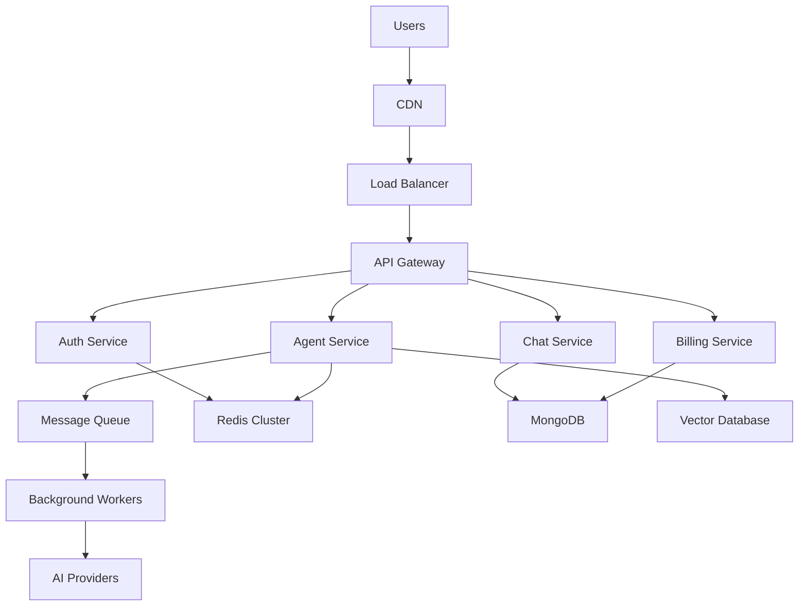
```mermaid
flowchart TB

    USERS["Users"]

    CDN["CDN"]

    LB["Load Balancer"]

    GATEWAY["API Gateway"]

    AUTH["Auth Service"]
    CHAT["Chat Service"]
    AGENT["Agent Service"]
    BILLING["Billing Service"]

    QUEUE["Message Queue"]

    REDIS["Redis Cluster"]

    MONGO["MongoDB"]

    VECTOR["Vector Database"]

    WORKERS["Background Workers"]

    AI["AI Providers"]

    USERS --> CDN
    CDN --> LB
    LB --> GATEWAY

    GATEWAY --> AUTH
    GATEWAY --> CHAT
    GATEWAY --> AGENT
    GATEWAY --> BILLING

    AGENT --> QUEUE
    QUEUE --> WORKERS

    AUTH --> REDIS
    CHAT --> MONGO
    BILLING --> MONGO
    AGENT --> REDIS
    AGENT --> VECTOR

    WORKERS --> AI
```

Possible future improvements include:

* Horizontal scaling of stateless services
* Background job processing
* Message queues
* Dedicated worker services
* Redis clustering
* MongoDB replica sets
* Vector database scaling
* Observability and distributed tracing
* Centralized logging
* API versioning
* Service-to-service authentication
* Circuit breakers
* Retry policies
* Idempotency keys for payment operations
* AI provider fallback routing
* Usage metering and cost tracking

---

## 16. Final Architecture

```text
                         ┌──────────────────────┐
                         │       USER           │
                         └──────────┬───────────┘
                                    │
                    ┌───────────────┴───────────────┐
                    │                               │
             ┌──────▼──────┐                 ┌──────▼──────┐
             │   Web SPA    │                 │   Electron  │
             │   React 19   │                 │   Desktop   │
             └──────┬──────┘                 └──────┬──────┘
                    │                               │
                    └───────────────┬───────────────┘
                                    │
                           ┌────────▼────────┐
                           │   API Gateway   │
                           │     :8000       │
                           └────────┬────────┘
                                    │
            ┌───────────────┬───────┼────────┬───────────────┐
            │               │       │        │               │
       ┌────▼────┐    ┌─────▼───┐ ┌─▼──────┐ ┌────▼─────┐
       │  Auth   │    │  Chat   │ │ Agent  │ │ Billing   │
       │  :8001  │    │  :8002  │ │ :8003  │ │  :8004   │
       └────┬────┘    └─────┬───┘ └──┬─────┘ └────┬─────┘
            │               │        │             │
            │               │   ┌────▼────┐        │
            │               │   │LangGraph│        │
            │               │   └────┬────┘        │
            │               │        │             │
            │               │   ┌────┼─────┐       │
            │               │   │    │     │       │
            │               │ Groq Gemini DeepSeek │
            │               │                     │
            │               │   ┌──────────────┐  │
            │               │   │ MCP Server   │  │
            │               │   └──────┬───────┘  │
            │               │          │          │
            │               │     Local Workspace │
            │               │                     │
            └───────────────┴──────────┬──────────┘
                                       │
                              ┌────────▼────────┐
                              │ MongoDB / Redis │
                              └─────────────────┘
```

**Alpha AI architecture goal:** a modular AI workspace where the Web and Electron clients communicate through a centralized gateway, specialized backend services own their respective domains, LangGraph orchestrates AI capabilities, and MCP provides controlled local workspace access.
